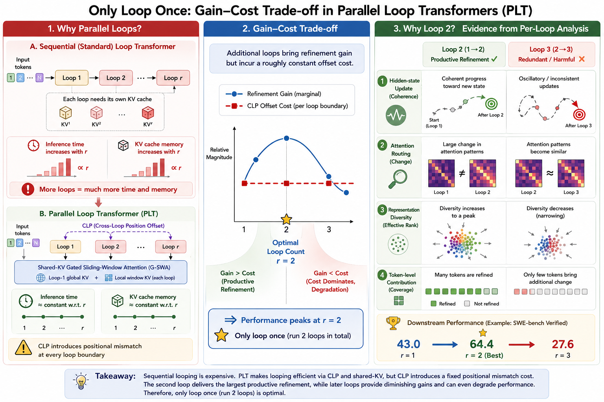
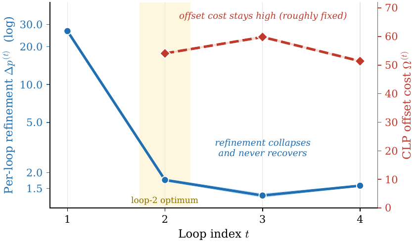

# LoopCoder-v2: Only Loop Once for Efficient Test-Time Computation Scaling

<p align="center">
  🤗 <a href="https://huggingface.co/Multilingual-Multimodal-NLP/LoopCoder-V2">HuggingFace</a>
  &nbsp;|&nbsp; 📄 <a href="https://arxiv.org/abs/2606.18023">arXiv:2606.18023</a>
  &nbsp;|&nbsp; 💻 <a href="https://github.com/CSJianYang/LoopCoder">GitHub</a>
  &nbsp;|&nbsp; 🤖 <a href="https://modelscope.cn/models/Multilingual-Multimodal-NLP/LoopCoder-V2">ModelScope</a>
</p>

> **TL;DR.** For Parallel Loop Transformers (PLT), *more looping is not better*. A 7B coder that loops just **once more than usual** (two passes total) lifts **SWE-bench Verified from 43.0 → 64.4**, while three or more loops *regress*. We explain this with a **gain–cost view** of looping and provide diagnostics for picking the loop count without brute-force sweeps.

<p align="center">
  
</p>

## Overview

Looped Transformers scale latent computation by repeatedly applying a shared block, but sequential looping increases latency and KV-cache memory with the loop count. **Parallel Loop Transformers (PLT)** alleviate this with two mechanisms:

- **CLP** — *cross-loop position offsets*, which break sequential inter-loop dependencies and enable parallel loop execution.
- **G-SWA** — *shared-KV gated sliding-window attention*, which keeps the cache footprint nearly constant across loop counts.

Once cost is flattened, **loop count becomes a free design knob** — and the question becomes: *how many loops are actually worth it?* We study this through a **gain–cost lens**: an extra loop may refine representations (gain), but CLP also introduces a roughly **constant positional mismatch** at each loop boundary (cost), which we quantify with an intrinsic offset cost $\Omega^{(r)}$.

We instantiate the study with **LoopCoder-v2**, a family of 7B PLT coders trained from scratch on **18T tokens** of mixed text and code (1:1, 100+ programming languages), under matched training, instruction tuning, and evaluation.

## Key Findings

- **Two loops win broadly.** The two-loop variant improves over the non-looped baseline across code generation, code reasoning, agentic software engineering, and tool-use benchmarks — e.g. **SWE-bench Verified 43.0 → 64.4**, **Multi-SWE 14.0 → 31.0**, **Terminal-Bench 11.2 → 21.0**, **BFCL 32.2 → 40.1**.
- **Punching above its weight.** At 64.4 on SWE-bench Verified, the 7B two-loop model surpasses **Qwen3-235B (45.2)** and approaches far larger open flagships like **Qwen3-Coder-480B (67.0)** and **Kimi-K2 (69.2)**.
- **Strongly non-monotonic.** Three or more loops *hurt* — SWE-bench Verified drops to **27.6 (R=3)** / **22.4 (R=4)**, below the no-loop baseline.
- **Why.** Loop 2 delivers the main productive refinement (hidden states converge, attention re-routes, output distribution shifts, representational diversity peaks). Later loops yield diminishing, oscillatory updates while the CLP offset cost stays roughly fixed — so beyond two loops, cost dominates gain.

## Results — Loop-Count Sweep (7B)

| Model (7B) | SWE-bench Verified | Multi-SWE | LiveCodeBench | Avg. (10 benchmarks) |
| :-- | :--: | :--: | :--: | :--: |
| No-loop Baseline (R=1) | 43.0 | 14.0 | 27.4 | 38.0 |
| **LoopCoder-v2 (R=2)** ⭐ | **64.4** | **31.0** | **35.4** | **46.5** |
| LoopCoder-v2 (R=3) | 27.6 | 11.0 | 28.6 | 36.9 |
| LoopCoder-v2 (R=4) | 22.4 | 9.3 | 24.5 | 34.3 |

<p align="center">
  
</p>
<p align="center"><i>Blue: per-loop refinement gain — collapses after loop 2. Red: CLP offset cost — roughly constant. Loop 2 is the optimal balance point.</i></p>

## Models

| Model | Loops | Link |
| :-- | :--: | :-- |
| LoopCoder-v2 | 2 (recommended) | 🤗 [Multilingual-Multimodal-NLP/LoopCoder-V2](https://huggingface.co/Multilingual-Multimodal-NLP/LoopCoder-V2) |

## Quick Start

```python
from transformers import AutoModelForCausalLM, AutoTokenizer

model_id = "Multilingual-Multimodal-NLP/LoopCoder-V2"
tokenizer = AutoTokenizer.from_pretrained(model_id, trust_remote_code=True)
model = AutoModelForCausalLM.from_pretrained(
    model_id, trust_remote_code=True, device_map="auto"
)

prompt = "Write a Python function that returns the n-th Fibonacci number."
inputs = tokenizer(prompt, return_tensors="pt").to(model.device)
outputs = model.generate(**inputs, max_new_tokens=256)
print(tokenizer.decode(outputs[0], skip_special_tokens=True))
```

> The two-loop (R=2) configuration is recommended. See the model card on HuggingFace for exact loading and loop-count settings.

## Citation

```bibtex
@misc{yang2026loopcoderv2loopefficienttesttime,
      title={LoopCoder-v2: Only Loop Once for Efficient Test-Time Computation Scaling}, 
      author={Jian Yang and Shawn Guo and Wei Zhang and Tianyu Zheng and Yaxin Du and Haau-Sing Li and Jiajun Wu and Yue Song and Yan Xing and Qingsong Cai and Zelong Huang and Chuan Hao and Ran Tao and Xianglong Liu and Wayne Xin Zhao and Mingjie Tang and Weifeng Lv and Ming Zhou and Bryan Dai},
      year={2026},
      eprint={2606.18023},
      archivePrefix={arXiv},
      primaryClass={cs.LG},
      url={https://arxiv.org/abs/2606.18023}, 
}
```

